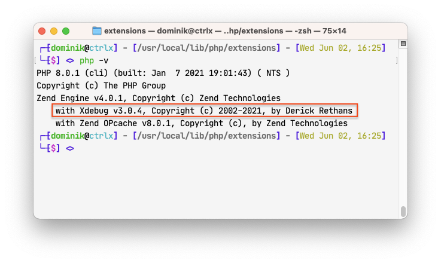

This guide is based on the works of [Asrar from dev.to](https://dev.to/asrar7787/mac-os-x-install-xdebug-with-multiple-php-versions-4377) and adapted to PHP 8.

If you dont have PHP 8 already install it using brew: `brew install php autoconf`

Download the latest version of [xDebug](https://xdebug.org/download). 

Then build and install the extension.

For example:
```shell
wget https://xdebug.org/files/xdebug-3.0.4.tgz
extract xdebug-3.0.4.tgz

cd xdebug-3.0.4
phpize
./configure
make

mkdir -p /usr/local/lib/php/extensions
mv modules/xdebug.so /usr/local/lib/php/extensions
cd ..
rm -rf xdebug-3.0.4

# Find the path to your php.ini
php --ini # e.g. /usr/local/etc/php/8.0/php.ini
echo "zend_extension=/usr/local/lib/php/extensions/xdebug.so" >> /usr/local/etc/php/8.0/php.ini
```

Next up it should look something like this:


