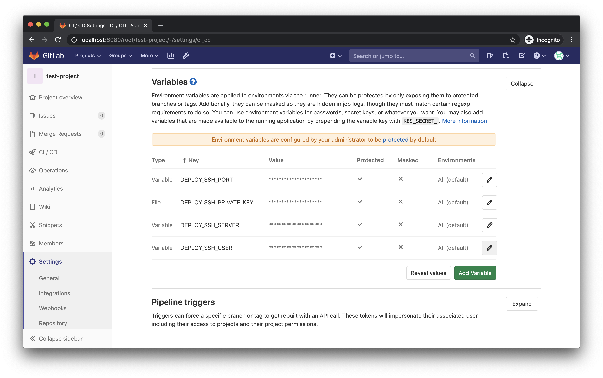

Connecting to a different server from your CI job can be a hassle. Specifying the ssh connection parameters followed by the command to be executed can take quite a lot of space visually and cause all kinds of trouble with linebreaks if you want to space out your command over multiple lines.

A better way is to create an ssh configuration on your Runner and simplify this especially if you need to connect to the target server multiple times.
Let me show you my solution and how it came about.

## Connecting to a remote server

First up, you need to make all parameters available inside the job, for example by using the Gitlab CI parameters.



You can now connect to an external server using the provided credentials:

```bash
# .gitlab.ci.yml

Deploy:
  script:
    - "ssh ${DEPLOY_SSH_SERVER} -l ${DEPLOY_SSH_USER} -p ${DEPLOY_SSH_PORT} -i ${DEPLOY_SSH_PRIVATE_KEY} 'ls -la $HOME'"
```

But specifying those ssh parameters for every command is tedious. There is a better way.

## Creating an ssh configuration

Running one-off commands using the parameterized ssh command is fine. Problems occured for me when I needed to connect to multiple times or to multiple different servers.

Always parameterizing the ssh command creates a lot of visual noise and makes it harder to understand what the given line is actually supposed to do.

Try to scan this script and figure out what happens here:
```yml
Deploy:
  script: 
    - "scp -P ${DEPLOY_SSH_PORT} -i ${DEPLOY_SSH_PRIVATE_KEY} -r artifacts ${DEPLOY_SSH_USER}@${DEPLOY_SSH_SERVER}:/opt/deploy_artifacts"
    - "ssh -p ${DEPLOY_SSH_PORT} -i ${DEPLOY_SSH_PRIVATE_KEY} ${DEPLOY_SSH_USER}@${DEPLOY_SSH_SERVER} 'systemctl stop my-application'"
    - "ssh -p ${DB_SSH_PORT} -i ${DB_SSH_PRIVATE_KEY} ${DB_SSH_USER}@${DB_SSH_SERVER} 'mysqldump --all-databases > backup.sql'"
    - "ssh -p ${DEPLOY_SSH_PORT} -i ${DEPLOY_SSH_PRIVATE_KEY} ${DEPLOY_SSH_USER}@${DEPLOY_SSH_SERVER} 'systemctl start my-application'"
```

Now again with a cleaner version where we separate configuration and workload:
```yml
Deploy:
  before_script:
    - "./ci/setup_ssh_configuration deploy_server ${DEPLOY_SSH_SERVER} ${DEPLOY_SSH_PORT} ${DEPLOY_SSH_USER} ${DEPLOY_SSH_PRIVATE_KEY}"
    - "./ci/setup_ssh_configuration db_server ${DB_SSH_SERVER} ${DB_SSH_PORT} ${DB_SSH_USER} ${DB_SSH_PRIVATE_KEY}"
  script:
    - "scp -r artifacts deploy_server:/opt/deploy_artifacts"
    - "ssh deploy_server    'systemctl stop my-application'"
    - "ssh db_server        'mysqldump --all-databases > backup.sql'"
    - "ssh deploy_server    'systemctl start my-application'"
```

By using a `before_script` we create a clear visual distinction between the configuration setup and the work that is actually done.

__./ci/setup\_ssh\_connections.sh__
```bash
#!/usr/bin/env bash

set -euo pipefail

mkdir -p ~/.ssh

echo """
Host ${1}
    Target ${2}
    Port ${3}
    User ${4}
    IdentifyFile ${5}
""" >> "~/.ssh/config"
```

### Even shorter configuration
The `before_script` can be even shorter if we accept a naming convention for those SSH connection parameters:

```bash
# {PREFIX}_SSH_SERVER {PREFIX}_SSH_USER ...
```

With some edits in our `setup_ssh_connection` script we can reduce the `yml` config to this:

````yaml
# .gitlab.ci.yml

Deploy:
  before_script:
    - "./ci/setup_ssh_configuration deploy_server DEPLOY"
    - "./ci/setup_ssh_configuration db_server DB"
  script:
    - "scp -r artifacts deploy_server:/opt/deploy_artifacts"
    - "ssh deploy_server    'systemctl stop my-application'"
    - "ssh db_server        'mysqldump --all-databases > backup.sql'"
    - "ssh deploy_server    'systemctl start my-application'"
````

````bash
#!/usr/bin/env bash
# ./ci/setup\_ssh\_connections.sh

set -euo pipefail

mkdir -p ~/.ssh

target="${2}_SSH_HOST"
port="${2}_SSH_PORT"
user="${2}_SSH_USER"
keypath="${2}_SSH_PRIVATE_KEY"

echo """
Host ${1}
    Target ${!target}
    Port ${!port}
    User ${!user}
    IdentifyFile ${!keypath}
""" >> "~/.ssh/config"
````

## Reusing connections

One more improvement that can be made is to reuse the ssh connections.

Depending on your CI-Setup you could have multiple scripts that connect to the same host within the same pipeline stage. Now, if your executed commands are all sub-second, the overhead of creating a new ssh session each time can be relatively large.

You can improve upon this by once more extending the `setup_ssh_connection.sh` to add the configuration for reusing previous tcp connections to the same host:

````bash
#!/usr/bin/env bash
# ./ci/setup\_ssh\_connections.sh

set -euo pipefail

mkdir -p ~/.ssh/sockets

target="${2}_SSH_HOST"
port="${2}_SSH_PORT"
user="${2}_SSH_USER"
keypath="${2}_SSH_PRIVATE_KEY"

echo """
Host ${1}
    Target ${!target}
    Port ${!port}
    User ${!user}
    IdentifyFile ${!keypath}
    ControlMaster auto
    ControlPath ~/.ssh/sockets/%r@%h-%p
    ControlPersist 600
""" >> "~/.ssh/config"
````

Read more about reusing connections for ssh https://puppet.com/blog/speed-up-ssh-by-reusing-connections
